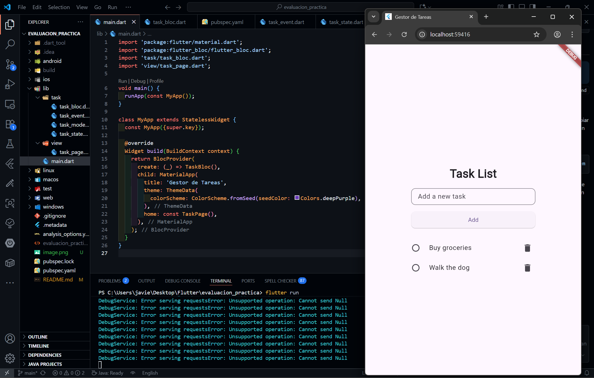

# Gestor de Tareas Flutter (BLoC)

Este proyecto es una aplicación Flutter sencilla para gestionar tareas utilizando el patrón BLoC. Permite agregar, marcar como completadas y eliminar tareas de una lista.

## Características

- **Agregar tareas:** Escribe el nombre de la tarea y pulsa "Add" para añadirla a la lista.
- **Completar tareas:** Marca/desmarca tareas como completadas usando el checkbox.
- **Eliminar tareas:** Elimina tareas con el botón de la papelera.
- **Interfaz centrada:** Todos los elementos están centrados y la lista de tareas tiene un ancho fijo.

## Estructura

- `lib/task/`: Contiene el modelo, eventos, estados y el BLoC de tareas.
- `lib/view/task_page.dart`: Vista principal donde se muestra y gestiona la lista de tareas.
- `lib/main.dart`: Punto de entrada de la app, configura el BLoC y la vista principal.

## Cómo ejecutar

1. Clona el repositorio.
2. Ejecuta `flutter pub get` para instalar dependencias.
3. Inicia la app con `flutter run`.

## Dependencias principales

- [flutter_bloc](https://pub.dev/packages/flutter_bloc)

## Captura de pantalla

---

Desarrollado como ecaluacion práctica de Flutter + BLoC.
